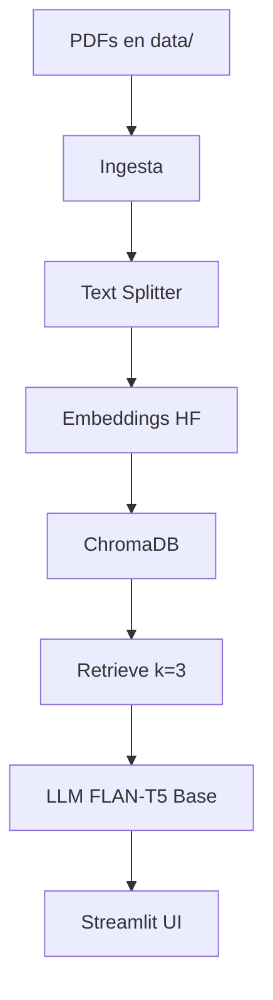
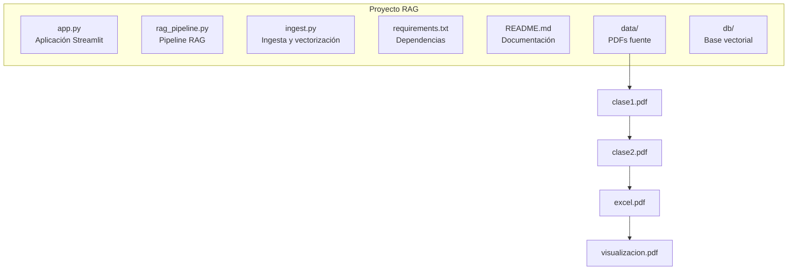

# DataTutor: Sistema RAG para Introducción al Análisis de Datos

## Descripción

DataTutor es un sistema de Retrieval-Augmented Generation (RAG) que permite consultar conceptos fundamentales de la materia Introducción al Análisis de Datos, utilizando como base un corpus compuesto por las presentaciones oficiales de la cátedra (IFTS 24).

El sistema permite realizar preguntas en lenguaje natural y devuelve respuestas citando los fragmentos exactos de los documentos donde se encontró la información.

Desarrollado como Trabajo Integrador N°2 para la materia NLP (NATURAL LANGUAGE PROCESSING) (IFTS 24).

## Demo

Ejecución local
streamlit run app.py

Abrir en navegador:
http://localhost:8501

## Problema que Resuelve

Los estudiantes deben revisar múltiples archivos PDF para ubicar definiciones, conceptos y ejemplos.
Este proceso es lento y disperso.

DataTutor resuelve el problema brindando:

Respuestas inmediatas basadas en el corpus real de la materia

Citas explícitas a los documentos

Recuperación semántica (no literal)

Un asistente conversacional ideal para estudio y repaso

El enfoque RAG es apropiado porque:

Las respuestas están ancladas a los documentos reales

El sistema evita alucinaciones

No requiere entrenamiento del modelo

Es transparente y verificable

## Arquitectura del Sistema

### Pipeline RAG

**Ingesta:**

Carga automática de PDFs ubicados en ./data usando DirectoryLoader + PyPDFLoader.

**Chunking:**

RecursiveCharacterTextSplitter

Chunk size: 800

Overlap: 200

**Embeddings:**

sentence-transformers/all-MiniLM-L6-v2

**Vector Storage:**

ChromaDB (persistencia local en ./db).

**Retrieval:**

Vector search

k = 3 chunks relevantes

**Generation:**

LLM local:

google/flan-t5-base

**Interfaz:**
Streamlit con chat y fuentes citadas.

## Diagrama de Flujo

## Stack Tecnológico

**LLM:** google/flan-t5-base

**Embeddings:** sentence-transformers/all-MiniLM-L6-v2

**Vector Database:** ChromaDB

**Orquestación:** LangChain

**Interfaz:** Streamlit

**Deployment:** Ejecución local

**Otras librerías:**

transformers

sentence-transformers

langchain

langchain-community

langchain-text-splitters

chromadb

pypdf

## Corpus de Documentos

**Dominio:** Introducción al Análisis de Datos

**Cantidad:** 4 documentos PDF

**Fuente:** Presentaciones oficiales del curso (IFTS 24)

**Formato:** PDF

**Idioma:** Español

**Documentos:**

#1 Introducción al análisis de datos.pdf

Intro a Datos #2.pdf

Introducción a Excel para Data Analytics.pdf

Introducción a la visualización de datos.pdf

## Instalación y Uso Local

### Prerrequisitos

Python 3.9+

Git instalado

## Pasos de instalación

Clonar el repositorio

git clone https://github.com/matiasdevivo/RAG_INTEGRADOR
cd proyecto-rag-datatutor

Crear entorno virtual

python -m venv .venv
.\.venv\Scripts\activate   # Windows

Instalar dependencias

pip install -r requirements.txt

Procesar documentos (primera vez)

python ingest.py

Ejecutar la aplicación

streamlit run app.py

Abrir en navegador: http://localhost:8501

## Estructura del Proyecto
├── app.py                  # Aplicación Streamlit
├── rag_pipeline.py         # Pipeline RAG (embeddings, llm, retrieval)
├── ingest.py               # Ingesta y vectorización de documentos
├── requirements.txt        # Dependencias
├── README.md               # Este archivo
├── data/                   # PDFs fuente
│   ├── clase1.pdf
│   ├── clase2.pdf
│   ├── excel.pdf
│   └── visualizacion.pdf
└── db/                     # Base vectorial generada

## Ejemplos de Consultas

“¿Qué es el análisis exploratorio de datos?”

“¿Qué diferencia hay entre variables cualitativas y cuantitativas?”

“¿Qué tipos de gráficos se usan para comparar categorías?”

“Explicame qué es un filtro avanzado en Excel.”

## Decisiones de Diseño
LLM: flan-t5-base

Elegido porque es liviano, rápido y funciona sin GPU.

Embeddings: MiniLM-L6-v2

Balance ideal entre velocidad y rendimiento semántico.

Chunk size = 800 + overlap de 200

Captura suficiente contexto sin cortar definiciones.

top-k = 3

Equilibrio entre relevancia y concisión.

## Limitaciones Conocidas

Corpus pequeño (4 PDFs)

No analiza imágenes de los slides

El modelo FLAN-T5 es limitado en profundidad

Solo funciona en español

Requiere ejecución local (sin deployment web)

## Mejoras Futuras

Agregar más documentos de la materia

Integrar un modelo más poderoso vía Ollama

Deployment en Hugging Face Spaces

Agregar almacenamiento de historial de chat

## Troubleshooting

“No module named langchain.chains”
pip install "langchain==0.2.16"

“ImportError: RecursiveCharacterTextSplitter”
pip install langchain-text-splitters

Streamlit queda congelado

Presionar:

Ctrl + C

## Autor

Matías de Vivo

## Información Académica

Trabajo Integrador N°2
Materia: NLP
Institución: IFTS 24 – Tecnicatura en Ciencia de Datos e IA
Profesor: Matías Barreto
Año: 2025
